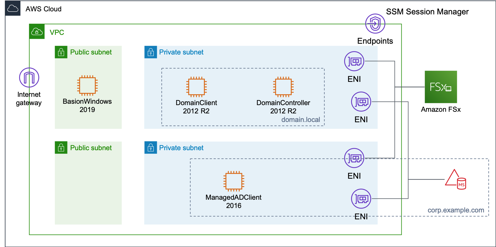
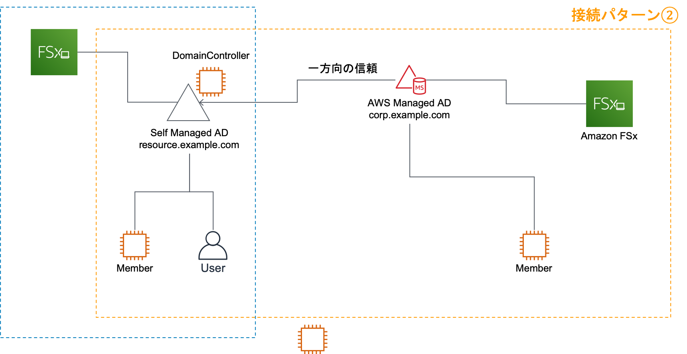

# FSx-PoC-Environment

#### インフラ構成



#### Active Directory構成



## 関連ドキュメント

- [よくある質問](https://aws.amazon.com/jp/fsx/windows/faqs/?nc=sn&loc=7)
- [ユーザーガイド](https://docs.aws.amazon.com/fsx/latest/WindowsGuide/what-is.html)
- [FSx CLI](https://docs.aws.amazon.com/cli/latest/reference/fsx/index.html)
- [FSx API](https://docs.aws.amazon.com/fsx/latest/APIReference/welcome.html)
- [Getting Started with Amazon FSx](https://docs.aws.amazon.com/fsx/latest/WindowsGuide/getting-started.html)
- [AWS Managed Microsoft AD のグループポリシーを使用して、ドメインユーザーに EC2 Windows インスタンスへの RDP アクセスを許可する方法を教えてください。](https://aws.amazon.com/jp/premiumsupport/knowledge-center/ec2-domain-user-rdp/)
- [AWS Managed Microsoft AD のユーザーとグループを管理する](https://docs.aws.amazon.com/ja_jp/directoryservice/latest/admin-guide/ms_ad_manage_users_groups.html)
- [Windows インスタンスを手動で参加させる](https://docs.aws.amazon.com/ja_jp/directoryservice/latest/admin-guide/join_windows_instance.html)

## 前提

- デプロイは管理者権限を持つIAMユーザーの権限で行うため、IAMユーザーを用意して下さい。
- あらかじめ、環境をデプロイするリージョンにキーペアを用意して下さい。このキーペアをEC2インスタンスに設定します。
- 以下のソフウェアがインストール済みであることを確認して下さい。

```shell
aws --version
python3 --version
node --version
npm --version
git --version
jq --version
```

## 確認項目

- Self Managed AD（resource.example.com）に参加するWindowsから、Self Managed AD（resource.example.com）に接続したFSxをマウントできることを確認する
- Self Managed AD（resource.example.com）に参加するWindowsから、Self Managed AD（resource.example.com）と信頼関係を結んだAWS Managed AD（corp.example.com）に接続したFSxをマウントできることを確認する

## CDKでのベースインフラストラクチャのデプロイ

### CDKのインストール

CDKをグローバルにインストールします。

```shell
npm install -g aws-cdk
```

### CDKプロジェクトのクローン

CDKプロジェクトをローカルにクローンします。

```shell
git clone https://github.com/sotoiwa/FSx-PoC-Environment.git
cd FSx-PoC-Environment
```

### Pythonの準備

Pythonのvirtualenvを作成して有効化します。

```shell
python3 -m venv .env
source .env/bin/activate
```

必要なpipモジュールをインストールします。

```shell
pip install -r requirements.txt
```

### 環境に合わせたカスタマイズ

`cdk.context.sample.json`を`cdk.context.json`としてコピーし、パラメータをいい感じに設定して下さい。

```shell
cp cdk.context.sample.json cdk.context.json
```

### デプロイ

CDKが使用するバケットを作成します。

```shell
cdk bootstrap
```

VPCと踏み台サーバーをデプロイします。

```shell
cdk deploy *NetworkStack *BastionStack --require-approval never
```

## Self Managed AD（resource.example.com）のセットアップ

ドメインコントローラー用のWindowsと、このドメインの管理下に置くWindowsをデプロイします。

```shell
cdk deploy *SelfManagedADStack --require-approval never
```

### ドメインコントローラーの作成

`resource.example.com`のドメインを作成します。

踏み台サーバー（BastionWindows）を経由してドメインコントローラー用のWindows（DomainControllerWindows）にRDPし、PowerShellを起動します。
あるいは、セッションマネージャーでPowerShellを起動します。

ADドメインサービスの機能をインストールします。

```powershell
Import-Module ServerManager
Get-WindowsFeature
Install-WindowsFeature -Name AD-Domain-Services -IncludeManagementTools
Get-WindowsFeature
```

ドメインコントローラーに昇格させます。セーフモード用のパスワードを聞かれるので入力します。

```powershell
#
# AD DS 配置用の Windows PowerShell スクリプト
#

Import-Module ADDSDeployment
Install-ADDSForest `
-CreateDnsDelegation:$false `
-DatabasePath "C:\Windows\NTDS" `
-DomainMode "Win2012R2" `
-DomainName "resource.example.com" `
-DomainNetbiosName "RESOURCE" `
-ForestMode "Win2012R2" `
-InstallDns:$true `
-LogPath "C:\Windows\NTDS" `
-NoRebootOnCompletion:$false `
-SysvolPath "C:\Windows\SYSVOL" `
-Force:$true
```

### メンバーWindowsのドメインへの参加

ドメインコントローラーのIPアドレスを確認します。

```shell
aws ec2 describe-instances | \
  jq -r '.Reservations[].Instances[] |
           select( .Tags ) | 
           select( [ select( .Tags[].Value | test("DomainControllerWindows") ) ] | length > 0 ) | 
           .PrivateIpAddress'
```

踏み台サーバーを経由してメンバー用のWindows（MemberWindows）にRDPし、PowerShellを起動します。
あるいは、セッションマネージャーでPowerShellを起動します。

DNSを変更します。

```powershell
Get-NetAdapter | Get-DnsClientServerAddress
Get-NetAdapter | Set-DnsClientServerAddress -ServerAddresses <ドメインコントローラのIPアドレス>
Get-NetAdapter | Get-DnsClientServerAddress
```

ADに参加します。ここで入力するパスワードはマネジメントコンソールでDomainControllerWindowsインスタンスの「接続」から確認します。

```powershell
$user = 'resource.example.com\Administrator'
$password = ConvertTo-SecureString -AsPlainText '<パスワード>' -Force
$Credential = New-Object System.Management.Automation.PsCredential($user, $password)
Add-Computer -DomainName resource.example.com -Credential $Credential
```

変更を反映するためリブートします。

```powershell
Restart-Computer -Force
```

### メンバーWindowsへのログイン確認

踏み台サーバーから、メンバーWindowsにドメインユーザーでRDPできることを確認します。
Self Managed ADのドメインユーザーは`Administrator@resource.example.com`です。
パスワードはドメインコントローラーの`Administrator`ユーザーのパスワードなので、マネジメントコンソールで確認できます。
上手くいかないときはドメインコントローラーとメンバーを再起動してみてください。

### FSxのデプロイ

Self Managed ADに接続するファイルシステムのデプロイにはドメンコントローラーのIPアドレスと、接続に使用するユーザーとパスワードが必要です。
`cdk.context.json`に記載します。

FSxリソースをデプロイします（かなり時間がかかります）。

```shell
cdk deploy *SelfManagedADFSxStack --require-approval never
```

### マウント確認

ファイルシステムのDNS名を確認します。

```shell
aws fsx describe-file-systems | \
  jq -r '.FileSystems[] |
           select( .Tags ) | 
           select( [ select( .Tags[].Value | test("SelfManagedADFileSystem") ) ] | length > 0 ) | 
           .DNSName'
```

RDPで接続し、ネットワークドライブを割り当てます。

## AWS Managed AD（corp.example.com）のセットアップ

AWS Managed ADと、このドメインの管理下に置くメンバーWindowsをデプロイします。

```shell
cdk deploy *AWSManagedADStack --require-approval never
```

### メンバーWindowsのドメインへの参加

ADのDNSサーバーのアドレスを確認します。

```shell
aws ds describe-directories | \
  jq -r '.DirectoryDescriptions[] | select( .Name == "corp.example.com" ) | .DnsIpAddrs[]'
```

踏み台サーバーを経由してメンバー用のWindowsにRDPし、PowerShellを起動します。あるいは、セッションマネージャーでPowerShellを起動します。

AD管理に必要なツールをPowerShellでインストールします。

```powershell
Import-Module ServerManager
Get-WindowsFeature
Install-WindowsFeature -Name GPMC,RSAT-AD-Tools,RSAT-DNS-Server
Get-WindowsFeature
```

DNSサーバーを変更します。

```powershell
Get-NetAdapter | Get-DnsClientServerAddress
Get-NetAdapter | Set-DnsClientServerAddress -ServerAddresses <1つ目のDNSアドレス>,<2つ目のDNSアドレス>
Get-NetAdapter | Get-DnsClientServerAddress
```

ADに参加します。`cdk.context.json`に記載したAWS Managed ADのパスワードを入力します。

```powershell
$user = 'corp.example.com\Admin'
$password = ConvertTo-SecureString -AsPlainText '<パスワード>' -Force
$Credential = New-Object System.Management.Automation.PsCredential($user, $password)
Add-Computer -DomainName corp.example.com -Credential $Credential
```

変更を反映するためリブートします。

```powershell
Restart-Computer -Force
```

### メンバーWindowsへのログイン確認

踏み台サーバーから、メンバーWindowsにドメインユーザーでRDPできることを確認します。
AWS Managed ADのドメインユーザーは`Admin@corp.example.com`です。パスワードは`cdk.context.json`で指定してます。
上手くいかないときはドメインコントローラーとクライアントを再起動してみてください。

### FSxのデプロイ

AWS Managed ADに接続するファイルシステムはディレクトリのIDが必要です。
CDK上で取得することもできますが、スタック間の依存を減らしたいので、`cdk.context.json`に記載するようにします。

```shell
aws ds describe-directories | \
  jq -r '.DirectoryDescriptions[] | select( .Name == "corp.example.com" ) | .DirectoryId'
```

FSxリソースをデプロイします（かなり時間がかかります）。

```shell
cdk deploy *AWSManagedADFSxStack --require-approval never
```

### 信頼関係の作成

- [Tutorial: Create a Trust Relationship Between Your AWS Managed Microsoft AD and Your On-Premises Domain](https://docs.aws.amazon.com/directoryservice/latest/admin-guide/ms_ad_tutorial_setup_trust.html)
- [オンプレの AD DS と AWS の Microsoft AD 間で片方向信頼関係を結ぶ](https://www.vwnet.jp/Windows/Other/2017020601/AWS_MSAD_trust.htm)

#### Self Managed AD側の作業

Self Managed AD側で条件付きフォワーダーを作成します。

```powershell
Get-DnsServerZone
Add-DnsServerConditionalForwarderZone `
    -Name "corp.example.com" `
    -MasterServers <1つ目のDNSアドレス>,<2つ目のDNSアドレス> `
    -ReplicationScope "Forest"
Get-DnsServerZone
```

Self Managed AD側で入力方向の一方向の信頼関係を作成します。
ここをPowerShellでやるのは大変なので（New-ADTrustのようなコマンドがない）、GUIでやります。

「Active Directory ドメインと信頼関係」から「新しい信頼」を作成します。

|項目|値|備考|
|---|---|---|
|信頼の名前|corp.example.com||
|信頼の種類|フォレストの信頼||
|信頼の方向|一方向: 入力方向||
|信頼を作成する対象|このドメインのみ||
|信頼パスワード|（任意）||
|入力方向の信頼を確認しますか?|確認しない||

#### AWS Managed AD側の作業

ADのセキュリティグループを探し、アウトバウンド接続でInternalSecurityGroupへの接続を全て許可します。
InternalSecurityGroupを探し、インバウンド接続でADのセキュリティグループからの接続を全て許可します。

AWS Managed AS側で、信頼を作成します。

```shell
TRUST_PASSWORD='<パスワード>'
DIRECTORY_ID=$(aws ds describe-directories | \
  jq -r '.DirectoryDescriptions[] | select( .Name == "corp.example.com" ) | .DirectoryId')
DNS_IP=$(aws ec2 describe-instances | \
  jq -r '.Reservations[].Instances[] |
           select( .Tags ) | 
           select( [ select( .Tags[].Value | test("DomainControllerWindows") ) ] | length > 0 ) | 
           .PrivateIpAddress')
aws ds create-trust \
  --directory-id ${DIRECTORY_ID} \
  --remote-domain-name resource.example.com \
  --trust-password ${TRUST_PASSWORD} \
  --trust-direction "One-Way: Outgoing" \
  --trust-type "Forest" \
  --conditional-forwarder-ip-addrs ${DNS_IP}
```

### マウント確認

ファイルシステムのDNS名を確認します。

```shell
aws fsx describe-file-systems | \
  jq -r '.FileSystems[] |
           select( .Tags ) | 
           select( [ select( .Tags[].Value | test("AWSManagedADFileSystem") ) ] | length > 0 ) | 
           .DNSName'
```

RDPで接続し、ネットワークドライブを割り当てます。

## Appendix

### Active Directoryでのユーザー追加

ユーザーを作成します。

```powershell
Get-ADUser -Filter *
$user = '<ユーザー名>'
$password = ConvertTo-SecureString -AsPlainText '<パスワード>' -Force
New-ADUser $user -AccountPassword $password
```

グループに追加します。

```powershell
Get-ADGroup -Filter *
Add-ADGroupMember -Identity Administrators -Members <ユーザー名>
Get-ADGroupMember -Identity Administrators
```
